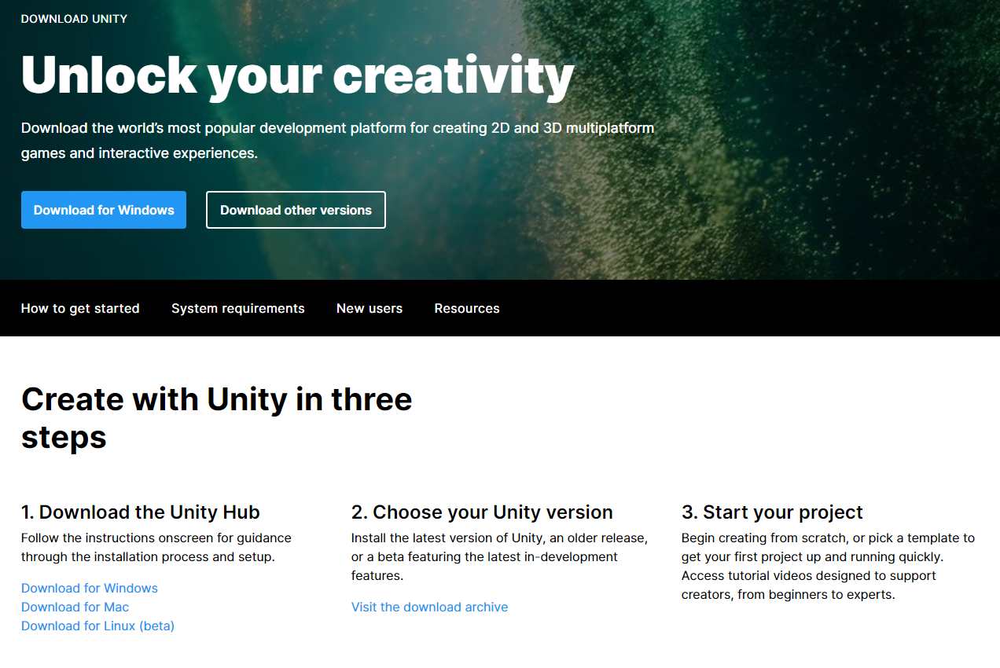

# UnityWorkshopTXSTIEEE
 This repo is for the TXST IEEE Game Development Workshop lead by Evan Smith

## Setup

1. Go to https://unity.com/download 
2. Under "1. Download the Unity Hub" Select the option for your OS
3. Launch the UnityHubSetup Installer
4. Follow the instructions from your platform to install UnityHub
5. Open the Unity Hub app